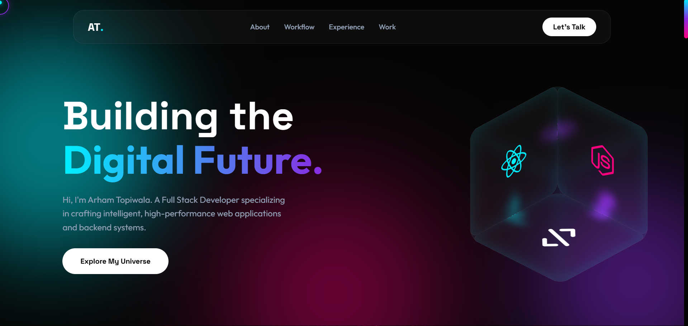

# 🌟 Arham's Glassmorphism Portfolio



Welcome to **Arham Topiwala**'s personal portfolio website! This is a stunning, interactive portfolio built with modern web technologies, featuring a glassmorphism design aesthetic and aurora-inspired animations. As a passionate Full Stack Developer, Arham showcases his expertise in crafting intelligent, high-performance web applications and backend systems.

## ✨ Features

- **🎨 Glassmorphism Design**: Sleek, translucent UI elements with backdrop blur effects
- **🌈 Aurora Background**: Dynamic animated blobs with neon cyan, purple, and magenta colors
- **🖱️ Custom Cursor**: Interactive dot and outline cursor with hover effects
- **🎲 3D Tech Cube**: Draggable rotating cube displaying technology icons
- **📊 Bento Grid Layout**: Modern grid system for organized content display
- **🎭 Marquee Animation**: Scrolling technology stack showcase
- **📱 Responsive Design**: Optimized for all devices and screen sizes
- **⚡ Smooth Animations**: CSS transitions and JavaScript-powered interactions

## 🛠️ Technologies Used

### Frontend
- **HTML5** - Semantic markup structure
- **CSS3** - Custom properties, flexbox, grid, and advanced animations
- **JavaScript (ES6+)** - Interactive functionality and DOM manipulation

### Design & UI
- **Glassmorphism** - Modern translucent design trend
- **Font Awesome** - Icon library for technology badges
- **Google Fonts** - Outfit and Space Grotesk typography

### Key Technologies Showcased
<div align="center">


</div>

## 🚀 Quick Start

1. **Clone the repository**
   ```bash
   git clone https://github.com/Arham43-ops/Glassmorphism_Portfolio.git
   cd Glassmorphism_Portfolio
   ```

2. **Open in browser**
   - Simply open `index.html` in your preferred web browser
   - No build process or server required!

## 📁 Project Structure

```
Glassmorphism_Portfolio/
├── index.html          # Main HTML structure
├── styles.css          # Glassmorphism styling and animations
├── script.js           # Interactive JavaScript functionality
└── README.md           # Project documentation
```

## 🎯 Portfolio Sections

### 🏠 Hero Section
- Eye-catching introduction with Arham's tagline
- Interactive 3D technology cube
- Call-to-action buttons

### 📊 Stats Bar
- **3+ Years** of professional experience
- **20+ Projects** successfully deployed
- **5+ Core Technologies** mastered
- **100% Client Satisfaction** rate

### 🔧 System Specs (About)
- Bento grid layout showcasing skills and expertise
- Professional background and technical proficiencies

### ⚙️ Workflow
- Development methodology and processes
- Project management approach

### 💼 Experience
- Professional journey and career highlights
- Tabbed interface for detailed experience breakdown

### 🏗️ Work (Projects)
- Showcase of notable projects and achievements
- Interactive project cards with hover effects

### 📞 Contact
- Get in touch section for collaborations and opportunities

## 🎨 Design Philosophy

This portfolio embodies the **glassmorphism** design trend, characterized by:
- Translucent backgrounds with subtle blur effects
- Soft borders and layered elements
- Aurora-inspired color palette for a futuristic feel
- Smooth animations that enhance user engagement without overwhelming

## 📱 Responsive & Accessible

- **Mobile-First**: Optimized for smartphones and tablets
- **Accessibility**: Proper semantic HTML and keyboard navigation
- **Performance**: Lightweight code with fast loading times
- **Cross-Browser**: Compatible with modern browsers

## 🤝 Connect with Arham

<div align="center">

[](https://linkedin.com/in/Arham43-ops)
[](https://github.com/Arham43-ops)
[](https://arham-creative-developer.netlify.app/)
[](mailto:arham@example.com)

</div>

---

**Built with ❤️ by Arham Topiwala**

*Crafting digital experiences that push the boundaries of web development.*

---

## 📄 License

This project is open source and available under the [MIT License](LICENSE).

---

*Star this repo if you found it inspiring! ⭐*</content>
<parameter name="filePath">c:\Stuff\Projects\Portfolios\Glassmorphism\README.md